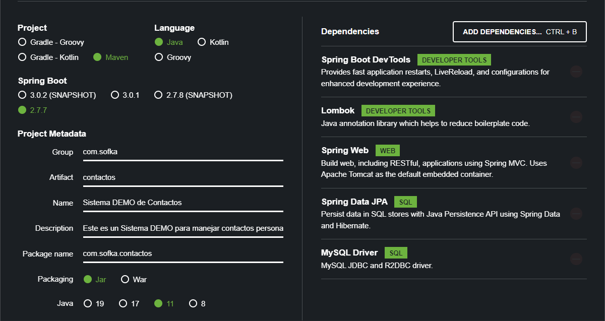

# API Rest en Spring Boot

Proyecto realizado en Spring Boot con las siguientes dependencias:

* Spring Boot Dev Tools
* Lombok
* Spring Web
* Spring Data JPA
* MySQL Driver

Utilizamos MySQL para gestion de Base de Datos de forma local y Postman para pruebas de consumo

Video de consumo del API con Postman : https://youtu.be/mEIUgx47_PE